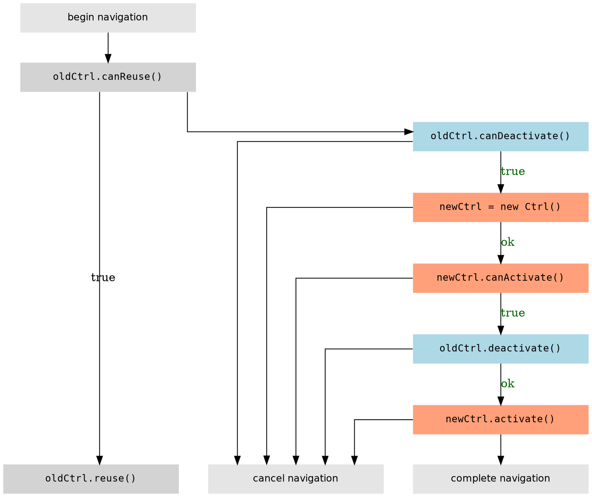

# Component Lifecycle Hooks

Lifecycle hooks let you control each stage of a route navigation.
There are four main lifecycle hooks: [`canActivate`](#can-activate), [`activate`](#activate), and [`canDeactivate`](#can-deactivate), and [`deactivate`](#deactivate).
A component can make use of these hooks by having its controller implement any number or combination of them.

To understand how this works, let's step through a simple case where a component wants to navigate from one route to another.

<!--
TODO: expected behavior of a navigation while another navigation is completing?
-->

## Controller Constructor

Before a component can fire any lifecycle hooks, Angular needs to instantiate it.
In this phase of routing, Angular [injects the controller's dependencies](https://docs.angularjs.org/guide/di#controllers).

<!-- <aside> -->
If the controller can't be instantiated (the constructor throws), the router cancels navigation.
However, you should avoid control flow logic by means of throwing exceptions.
If you have logic that determines whether or not to perform a navigation, use the `canActivate` hook instead.
<!-- </aside> -->

Constructors should be lightweight.
If you need to do a lot of work to setup a controller, consider using the [`activate`](#activate) lifecycle hook.

## canActivate

Before switching to a new component, this hook runs for each active component in the app.
If any of them return `false`, a rejected promise, or a promise that resolves to `false`,
the navigation is cancelled.

This hook is useful for authentication.

### Example

```js
angular.module('app', [])
  .controller('MyController', ['user', '$http', MyController]);

function MyController(user, $http) {
  this.user = user;
  this.$http = $http;
}

MyController.prototype.canActivate = function() {
  return this.user.isAdmin;
};
```

## activate

This hook fires just before the nagivation finishes.

This hook is useful for cases where you want your component to do some intensive work.

### Example

```js
angular.module('app', [])
  .controller('MyController', ['user', '$http', MyController]);

function MyController(user, $http) {
  this.user = user;
  this.$http = $http;
}

MyController.prototype.canActivate = function() {
  return this.user.isAdmin;
};

MyController.prototype.activate = function() {
  return this.bigFiles = this.$http.downloadBigFiles();
};
```

## canDeactivate

This hook fires for each component that is removed as part of navigation.
`canDeactivate` fires before any new components are instantiated.
If any of them return `false`, a rejected promise, or a promise that resolves to `false`,
the navigation is cancelled.

`canDeactivate` is useful for making sure that data is properly persisted before navigating away.

### Example

In this example, we show a dialog asking a user whether or not to save their work
before continuing.

```js
angular.module('app.save', [])
  .controller('SaveController', ['$q', SaveController]);

function SaveController($q) {
  this.$q = $q;
}

/*
 * return a promise that is resolved based on the user's
 * choice in a dialog box
 */
SaveController.prototype.canDeactivate = function() {
  this.deferred = this.$q.defer();
  this.showSaveDialog = true;
  return this.deferred.promise();
};
```

```html
<div>
  <div ng-show="showSaveDialog">
    <p>Would you like to save your work?</p>
    <button ng-click="save.deferred.resolve()">Save</button>
    <button ng-click="save.deferred.reject()">Discard</button>
  </div>
</div>
```

## deactivate

This hook fires for each component that is removed as part of navigation.
`deactivate` is useful for doing cleanup work.

This hook fires after the `canActivate` of the new component and `canDeactivate` of the component to be removed, but before `activate` of the new component.

## An example

In this example, we have a component that prevents navigation until a user saves

```js
angular.module('app.my', [])
  .controller('MyController', ['user', '$http', MyController]);

function MyController(user, $http) {
  this.user = user;
  this.$http = $http;
  this.userDataPersisted = true;
}

MyController.prototype.updateUserName = function(newName) {
  var self = this;
  this.userDataPersisted = false;
  return this.user.setName(newName).then(function () {
    self.userDataPersisted = true;
  });
};

MyController.prototype.canActivate = function() {
  return this.user.isAdmin;
};

MyController.prototype.activate = function() {
  this.user.downloadBigFiles();
};

MyController.prototype.canDeactivate = function() {
  return this.userDataPersisted;
};
```

<!-- TODO: finish this, add example
## canReactivate and reactivate

This hook allows you to reuse a component when navigating.

It's useful for adding animations.

This hook is run if the above is true. Instead of destroying the existing component and
instantiating a new one, a component's `reactivate` hook is called when a navigation
completes.

### Example

TODO
-->

## Overview

This is the basic logic that the router uses when determining whether or not to perform a navigation.




<!--
TODO: finish this
## Handling failure

What happens when a `canActivate` or `canDeactivate` returns `false`?

By default, this stops the navigation entirely.

TODO: show multiple levels
-->


<!--
## Hooks in Multiple levels
TODO: show multi-level
-->
